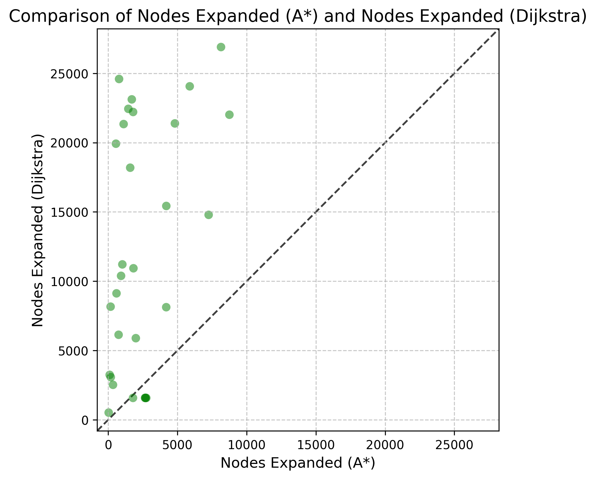
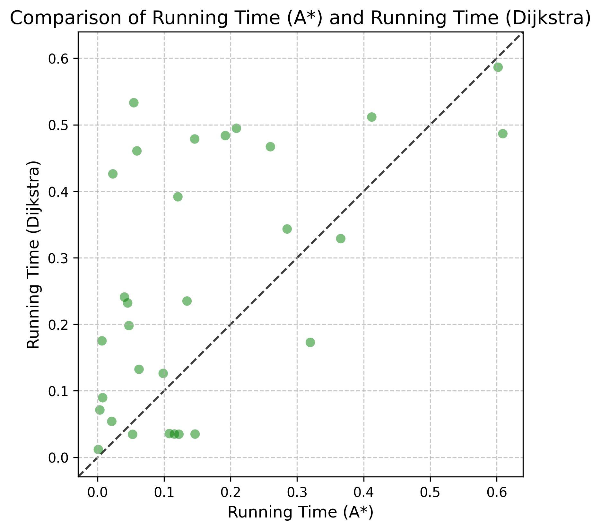

# Pathfinding: A* vs. Dijkstra

This repository is a compact algorithm engineering project comparing **A*** and **Dijkstra's algorithm** on grid-based pathfinding.

I implemented both algorithms in Python, evaluated them on the Moving AI benchmark map `brc000d.map`, and compared their performance on **30 test instances** using two metrics:

- nodes expanded
- running time

The repo is simple on purpose: no over-design, easy to read, easy to run, and easy to reproduce.

## Paper

The accompanying paper for this project is included here in a public-share version:

- [Public PDF](paper/A_Comparative_Analysis_of_Astar_and_Dijkstra_Algorithms_for_Grid_Based_Pathfinding_Public.pdf)
- [Public DOCX](paper/A_Comparative_Analysis_of_Astar_and_Dijkstra_Algorithms_for_Grid_Based_Pathfinding_Public.docx)

## What This Project Shows

- clean implementation of **Dijkstra**
- clean implementation of **A*** with **Octile distance** heuristic
- **8-direction movement** with diagonal cost `1.5`
- benchmark-based evaluation on grid maps
- automatic plot generation for experiment comparison

## Tech Stack

- Python
- NumPy
- Matplotlib

## Project Structure

```text
.
├── main.py
├── requirements.txt
├── search
│   ├── algorithms.py
│   ├── map.py
│   └── plot_results.py
├── test-instances
│   └── testinstances.txt
├── dao-map
│   └── brc000d.map
├── figures
│   ├── nodes_expanded_comparison.png
│   └── running_time_comparison.png
├── paper
│   ├── A_Comparative_Analysis_of_Astar_and_Dijkstra_Algorithms_for_Grid_Based_Pathfinding_Public.docx
│   └── A_Comparative_Analysis_of_Astar_and_Dijkstra_Algorithms_for_Grid_Based_Pathfinding_Public.pdf
└── archive
    └── main_history_20240131194650.py
```

`archive/` keeps an earlier snapshot of the implementation that is close to the original paper-writing stage.

## Experiment Setup

- Map: `dao-map/brc000d.map`
- Instances: `test-instances/testinstances.txt`
- Heuristic for A*: **Octile distance**
- Search space: grid map with cardinal and diagonal moves
- Cost model:
  - cardinal move = `1.0`
  - diagonal move = `1.5`

## Quick Start

```bash
python3 -m venv .venv
source .venv/bin/activate
pip install -r requirements.txt
python main.py
```

After running, the script generates comparison plots in the repository root:

- `nodes_expanded.png`
- `running_time.png`

## Result Snapshot

The experiment shows a clear pattern:

- **A*** consistently expands fewer nodes than Dijkstra
- **A*** is usually faster, but the runtime advantage is more mixed than the node-expansion advantage

Pre-generated comparison figures are available in `figures/`.





## Why I Built This

This project comes from my work on pathfinding algorithm analysis. I wanted to make the comparison not only theoretical, but also executable and measurable.

For me, this repo is a small but complete example of:

- algorithm implementation
- reproducible experimentation
- benchmark-based evaluation
- result visualization

## Notes

- The codebase is intentionally lightweight and academic-style.
- The benchmark map format follows the Moving AI grid map convention.
- If you want the earlier implementation snapshot, check `archive/main_history_20240131194650.py`.
